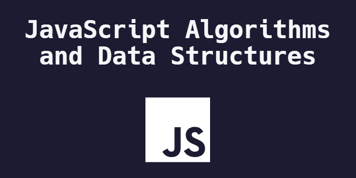

  

# Follow Along with FreeCodeCamp - JavaScript Algorithms and Data Structures
## https://www.freecodecamp.org/learn/javascript-algorithms-and-data-structures/

### I wanted to work through this free online course and chronicle here! I have taught algos and been an instructor for fullstack web applications written in Python (Flask & Django/MySQL), Javascript (MEAN/MERN/Mongoose), and Java (STS/MySQL). My goal for going through this course is to see how the same concepts I know are taught elsewhere, and see how my translating of simple or complex ideas can be improved.

Please note that the online course does not break things into the sections that I have chosen to include. I am tryig to assign sections based on how the course is organized, so I can better understand and follow it's logic and progression.

I have added the link, description, and assignment for each lesson. I have also modified some of the provided code to include console.log() statements in most cases, as I am running the code before submitting blindly. 

I did not write any additional tests, only relied on the logs and the tests provdided by the site.